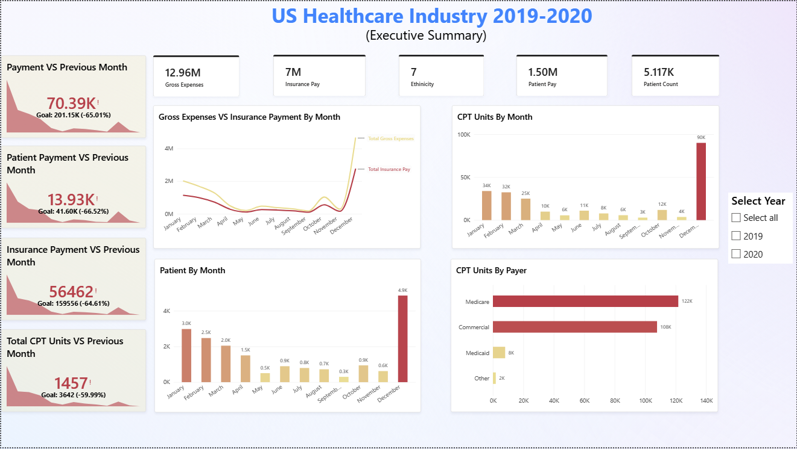
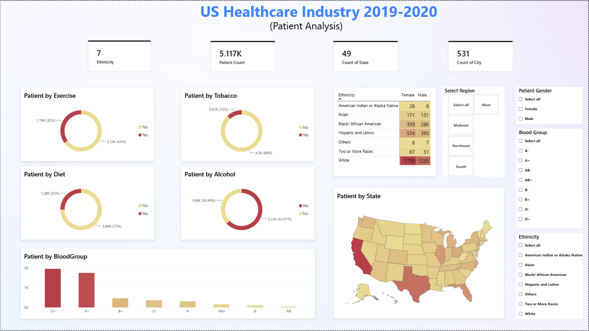
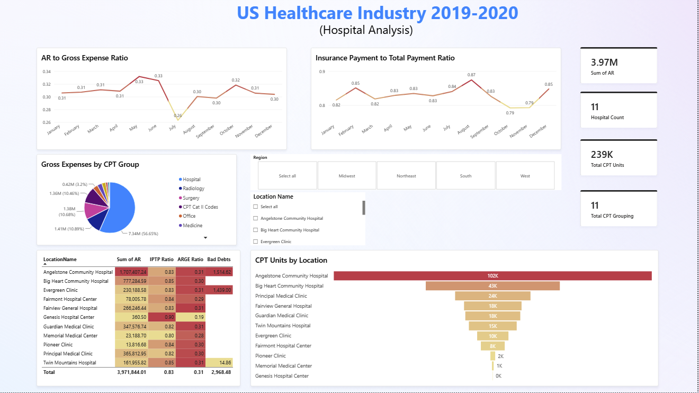
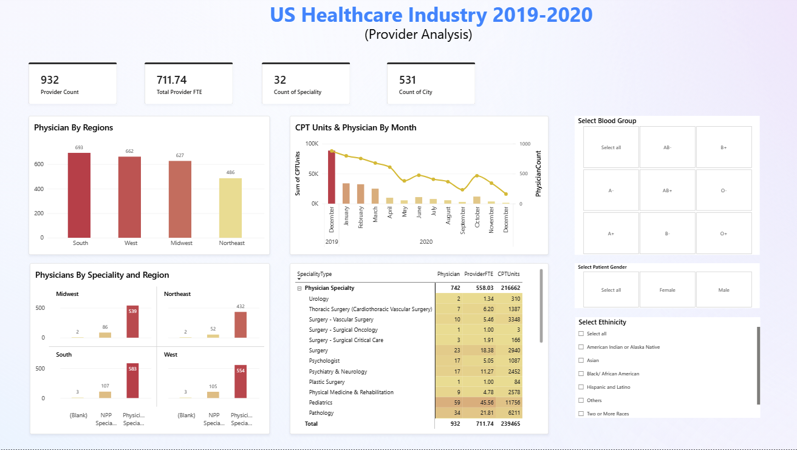

# US Healthcare Analytics Dashboard

## Introduction
Created an interactive dashboard using Power BI to analyze revenue cycle, patient, hospital, and provider data across the United States for 2019 to 2020.
The goal of the project was to transform healthcare data so stakeholders can interact with it and uncover hidden insights; it helps explain **payments, accounts receivable (AR), CPT utilization, patient demographics, hospital performance, and provider productivity**.

The report is organized into four interactive pages:

1. Executive Summary
2. Patient Analysis
3. Hospital Analysis
4. Provider Analysis

## Tools & Skills Used
- Power BI
- Data Analysis Expressions (DAX)
- Power Query
- Data Modeling
- Star Schema
- Healthcare Domain Knowledge

## Data Model
The Power BI model uses a dimensional structure consisting of a central fact table connected to multiple dimension tables.
The **Fact Table** contains transactional healthcare information such as:
- Gross Expenses
- Insurance Payments
- Patient Payments
- Accounts Receivable (AR)
- Adjustments
- CPT Units

Dimension tables provide additional information about:
- Patients
- Physicians
- Hospitals
- Payers
- CPT Codes
- Diagnosis Codes
- Specialties
- Transactions
- Dates

## Dashboard Pages

### 1. Executive Summary
The Executive Summary provides a high level view of healthcare financial and operational performance.
Key metrics include:
- Gross Expenses
- Insurance Payments
- Patient Payments
- Patient Count
- CPT Units
- Monthly Payment Trends
- Previous-Month Payment Comparisons
- CPT Units by Payer
- Monthly Patient Volume

The dashboard also allows users to filter results by year.

### 2. Patient Analysis
The Patient Analysis page explores patient demographics and lifestyle characteristics.
Analysis includes:
- Patient distribution by state and region
- Gender
- Ethnicity
- Blood group
- Tobacco use
- Alcohol use
- Exercise
- Diet

Interactive slicers allow users to explore how patient populations differ across demographic groups and geographic regions.

### 3. Hospital Analysis
The Hospital Analysis page focuses on healthcare revenue cycle and hospital level operational performance.
Key analysis includes:
- Accounts Receivable (AR)
- AR to Gross Expense Ratio
- Insurance Payment to Total Payment Ratio
- Gross Expenses by CPT Group
- CPT Units by Location
- Hospital level AR comparison
- Bad Debt
- Regional and hospital filtering

This page helps identify differences in financial and service activity across healthcare locations.

### 4. Provider Analysis
The Provider Analysis page focuses on physician distribution, specialty, workload, and productivity.
Key analysis includes:
- Provider Count
- Provider FTE
- Physicians by Region
- Physicians by Specialty
- CPT Units by Physician
- Monthly CPT activity
- Specialty level provider comparison
- Regional provider distribution

Provider FTE is used to provide additional context when comparing provider capacity and productivity.

## DAX Measures
Several DAX measures were created to support the analysis, including:
- %Females
- %Males
- Total Insurance Payment
- Total Patient Payment
- Total Payment
- Total Gross Expenses
- Total CPT Units
- Accounts Receivable Ratio
- Insurance Payment to Total Payment Ratio
- Previous Month Payment
- Previous Month Insurance Payment
- Previous Month Patient Payment
- Previous Month CPT Units
- Quarter-to-Date (QTD) Payment
- 10-Day Rolling Payment
- Patient Count
- Physician Count
- Bad Debt

Time-intelligence calculations were used to compare current performance with previous periods and analyze payment trends over time.

## Key Insights
Some observations from the dashboard include:
- Insurance payments account for the majority of total payments in the dataset.
- Accounts receivable levels vary across healthcare locations and over time.
- CPT utilization differs significantly between payer groups and healthcare locations.
- Medicare and commercial payers account for a large share of CPT activity.
- Patient demographics and geographic distribution can be explored across multiple dimensions.
- Provider counts, FTE, specialty, and CPT activity vary across regions and specialties.
- Monthly analysis reveals noticeable changes in payments and CPT activity throughout the reporting period.

## Dashboard Preview

### Executive Summary

### Patient Analysis

### Hospital Analysis

### Provider Analysis

## Business Questions Addressed

This dashboard was designed to answer questions such as:

- How much revenue is coming from insurance versus patient payments?
- How are payments changing month over month?
- What is the relationship between AR and gross expenses?
- Which payer groups account for the highest CPT utilization?
- Which healthcare locations have the highest AR and CPT activity?
- How are patients distributed geographically and demographically?
- How are physicians distributed across specialties and regions?
- How does provider FTE relate to provider activity?
- How does healthcare activity change over time?

## Author

**Ashish Kushwaha**
Data Analytics | Business Intelligence | Healthcare Analytics
